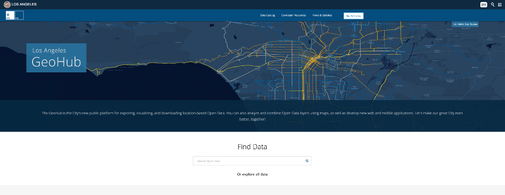
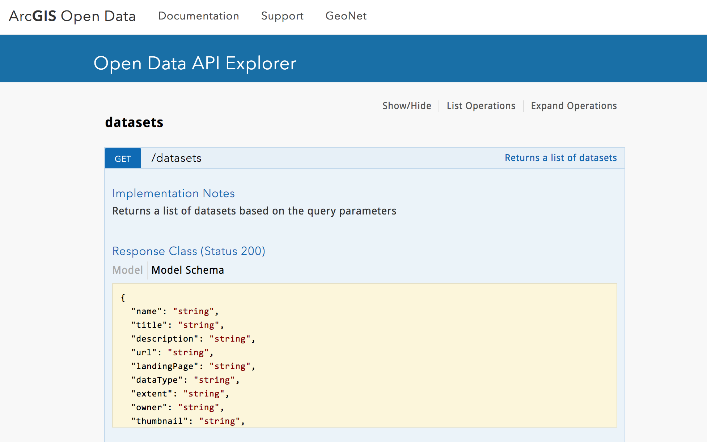

<!-- .slide: class="title" -->

## Un ejemplo de Open Data API
Raul Jimenez ([@hhkaos](https://twitter.com/hhkaos))

[esri-es.github.io/demos/2017/api-addicts](https://esri-es.github.io/demos/2017/api-addicts)

---

### Esri (Company) & ArcGIS (Platform)

---

##### [www.rauljimenez.info](www.rauljimenez.info)

---

<iframe src="https://developers.arcgis.com/startups/" style="width:100%; height:650px;background-color:white;"></iframe>

[esri.com/startups](http://esri.com/startups) | [startups.esri.es](http://startups.esri.es)

---

## ArcGIS REST APIs

* [ArcGIS Online](https://hhkaos.github.io/awesome-arcgis/arcgis/products/arcgis-online/rest-apis/)
* [ArcGIS Open Data](https://hhkaos.github.io/awesome-arcgis/arcgis/products/arcgis-online/rest-apis/#arcGIS-open-data)
* [ArcGIS Server](https://hhkaos.github.io/awesome-arcgis/arcgis/products/arcgis-enterprise/arcgis-server/#rest-api)
* [Portal for ArcGIS](https://hhkaos.github.io/awesome-arcgis/arcgis/products/arcgis-enterprise/portal-for-arcgis/#rest-api)
* [Know more...](https://hhkaos.github.io/awesome-arcgis/arcgis/open-specifications/arcgis-rest-api/)

---

<!-- .slide: class="frameworks" -->

## ArcGIS Compatibility

We provide resources to help you build apps using:

[.NET](https://hhkaos.github.io/awesome-arcgis/mobile/technologies/dot-net/),
[Android](https://hhkaos.github.io/awesome-arcgis/mobile/technologies/android/),
[Angular](https://hhkaos.github.io/awesome-arcgis/front-end/technologies/angular/),
[Backbone](https://hhkaos.github.io/awesome-arcgis/front-end/technologies/backbone/),
[Dojo](https://hhkaos.github.io/awesome-arcgis/front-end/technologies/dojo/),
[Ember](https://hhkaos.github.io/awesome-arcgis/front-end/technologies/ember/),
[iOS](https://hhkaos.github.io/awesome-arcgis/mobile/technologies/ios/),

[Java](https://hhkaos.github.io/awesome-arcgis/desktop/technologies/java/),
[jQuery](https://hhkaos.github.io/awesome-arcgis/front-end/technologies/jquery/),
[Knockout](https://hhkaos.github.io/awesome-arcgis/front-end/technologies/knockout/),
[Leaflet](https://hhkaos.github.io/awesome-arcgis/front-end/technologies/leaflet/),
[Open layers](https://hhkaos.github.io/awesome-arcgis/front-end/technologies/open-layers/),
[Phonegap](https://hhkaos.github.io/awesome-arcgis/front-end/technologies/phonegap/),

[Polymer](https://hhkaos.github.io/awesome-arcgis/front-end/technologies/polymer/),
[Qt](https://hhkaos.github.io/awesome-arcgis/mobile/technologies/qt/),
[React](https://hhkaos.github.io/awesome-arcgis/front-end/technologies/react/),
[Sencha](https://hhkaos.github.io/awesome-arcgis/front-end/technologies/sencha/),
[VueJS](https://hhkaos.github.io/awesome-arcgis/front-end/technologies/vuejs/), ...

---

<iframe src="http://opendata.arcgis.com/" style="width:100%; height:650px;background-color:white;"></iframe>

ArcGIS Open Data: [opendata.arcgis.com](http://opendata.arcgis.com) | [opendata.esri.es](http://opendata.esri.es)

---

## Los Angeles Open Data

Custom Open Data portals: [Backbone sample](https://github.com/esridc/OpenData-Backbone) & [Ember sample](https://github.com/mjuniper/opendata-ember)

---

## [Koop](https://koopjs.github.io/)
##### *(Open Geospatial ETL Engine)*

> Leave geospatial data where it lives and transform it into GeoJSON, CSV, KML, a Shapefile, ... dynamically.

---

### ArcGIS: [Open Data API](http://akharris.github.io/ember-arc-swag/)

---

<!-- .slide: class="questions centered" -->

## Questions?

Raul Jimenez ([@hhkaos](https://twitter.com/hhkaos))

Slides: [esri-es.github.io/demos/2017/api-addicts](https://esri-es.github.io/demos/2017/api-addicts)

---

<!-- .slide: class="end" -->
#
