<!-- .slide: class="title" -->

## From Data to GeoData in 30min  
## with ArcGIS
### Hackathon Mobilitylabs
Raúl Jiménez - Esri España

[bit.ly/mobiEsri](http://bit.ly/mobiEsri)

---

<!-- .slide: class="section" -->

## About us

<iframe src="trends.html" style="background-color:white;width:100%; height:500px; border:2px solid white"></iframe>

---

<!-- .slide: class="section" -->

<iframe src="http://hhkaos2.maps.arcgis.com/apps/MapSeries/index.html?appid=5b3e896aeeaa4601b71359f29ec3f090" style="width:100%; height:700px; border:2px solid white"></iframe>

---

<!-- .slide: class="section" -->
## Tools

---

<!-- .slide: class="section" -->
## Github repo:

[esri-es/mobilitylab-emtmadrid](https://github.com/esri-es/mobilitylab-emtmadrid)
 [esri/geodev-hackerlabs](https://github.com/Esri/geodev-hackerlabs)

---

<!-- .slide: class="section" -->

## Open Data

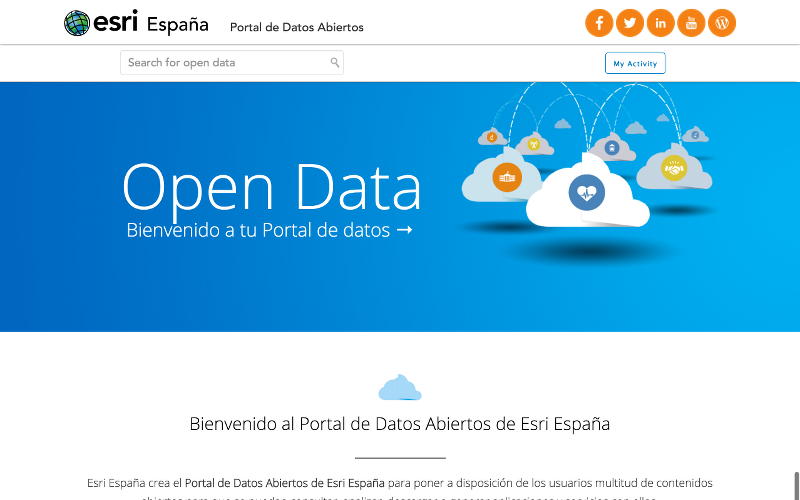

[opendata.esri.es](http://opendata.esri.es/)

---

<!-- .slide: class="section" -->

## ArcGIS Online  - Map editor

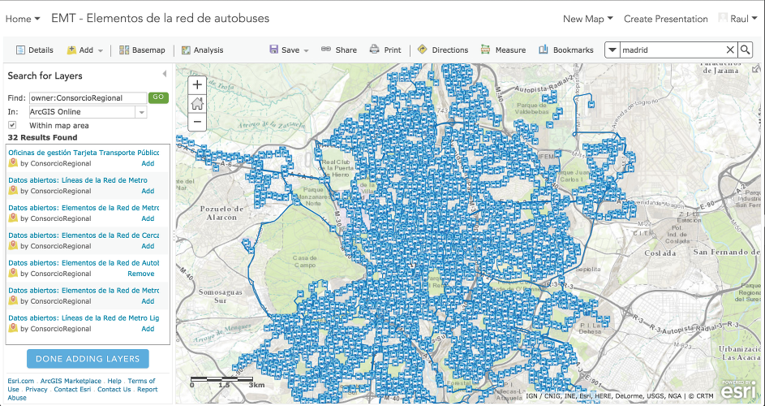

[developers.arcgis.com/sign-up](https://developers.arcgis.com/sign-up)

---

<!-- .slide: class="section" -->

## Real Time Data

[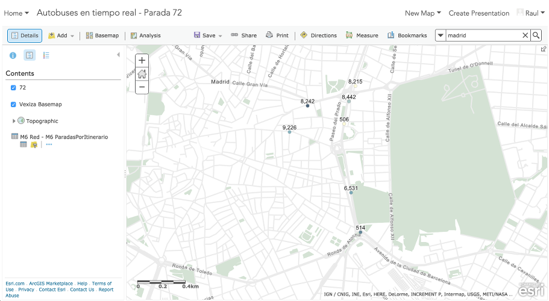](http://hhkaos2.maps.arcgis.com/home/webmap/viewer.html?webmap=3ae3c74f0b1440c1a621ed55cc14160a)

---

<!-- .slide: class="section" -->

[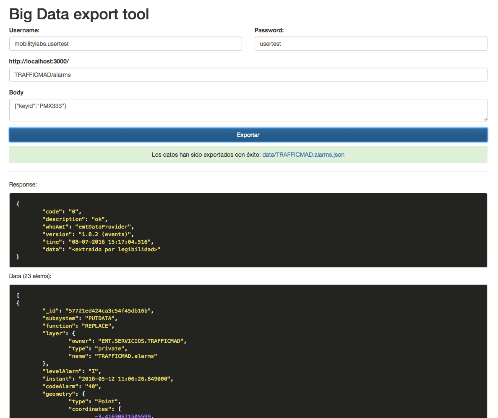](https://github.com/esri-es/mobilitylab-emtmadrid/tree/master/big-data/export-tool)

---

<!-- .slide: class="section" -->

## Geoenrichment

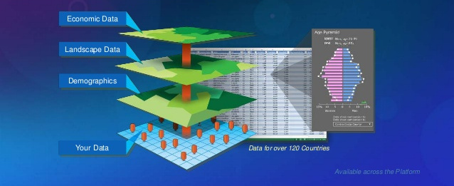

[developers.arcgis.com/rest/geoenrichment/](https://developers.arcgis.com/rest/geoenrichment/)

---

<!-- .slide: class="section" -->
## WYSIWYG Builders
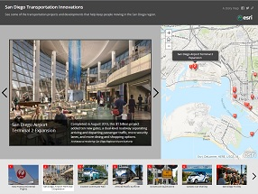
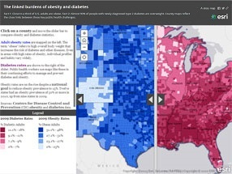
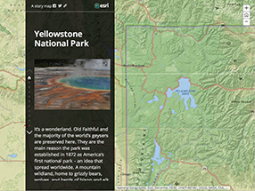

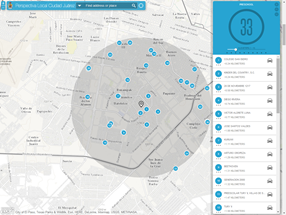
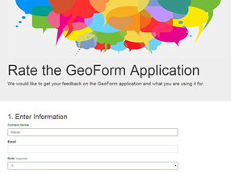
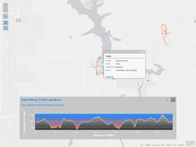

---

<!-- .slide: class="section" -->
## App Builders - Native

---

<!-- .slide: class="section" -->
## App Builders

Tool|Platforms
---|---
[Storymaps](https://storymaps.arcgis.com/)|Web responsive
[Configurable apps (+20)](http://www.arcgis.com/home/search.html?t=content&q=tags:ArcGIS%20web%20application%20template)|Web responsive
[Web AppBuilder](http://www.esri.com/software/web-appbuilder)|Web
[AppStudio](http://appstudio.arcgis.com/)|Android, iOS, Windows, OS X & Linux
[Survey123](http://survey123.esri.com/)|Android, iOS, Windows, OS X & Linux

---

<!-- .slide: class="section" -->
### APIs, SDKs & Libraries

Tool|Platforms
---|---
[API  JavaScript](https://developers.arcgis.com/javascript/) & [WAB Developer Edition](https://developers.arcgis.com/web-appbuilder/)|Web
[Android SDK](https://developers.arcgis.com/android/)|Android
[iOS SDK](https://developers.arcgis.com/ios/)|iOS
[Xamarin](https://developers.arcgis.com/xamarin/)|Android & iOS
[.NET SDK](https://developers.arcgis.com/net/)|Windows desktop & Windows Phone
[Java SDK](https://developers.arcgis.com/java/)|Windows & Linux
[Qt SDK](https://developers.arcgis.com/qt/)|Windows, Linux, Android & iOS
[OS X SDK](https://developers.arcgis.com/os-x/)|Mac
[Python API](https://developers.arcgis.com/python/) & [API REST](http://resources.arcgis.com/en/help/arcgis-rest-api/index.html#//02r300000054000000)|Agnostic

---

<!-- .slide: class="section" -->
### Also compatible with:

* **3rd party technologies:** 
AngularJS, Ember.js, Backbone, Knockout, React,  
jQuery+Bootstrap, Dojo+Dijit, D3.js, Polymer,  
ExtJS, Sencha Touch, jQuery Mobile, Leaflet, Ionic, ...

* **Services:**  
OpenStreetMaps, Mapbox, Bing, Stamen, Mapillary, etc.

---

<!-- .slide: class="questions centered" -->

## At your disposal

  
 Raúl | Carlos | Carlos

---

<!-- .slide: class="end" -->
