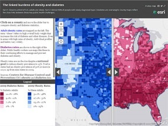
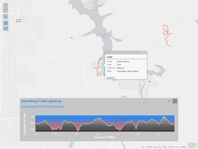

<!-- .slide: class="title" -->

## I Hackathon
### Cátedra de Seguridad Emergencias y Catástrofes
Raúl Jiménez - Esri España

[bit.ly/umappt](http://bit.ly/umappt)

---

<!-- .slide: class="section" -->
## Herramientas

---

<!-- .slide: class="section" -->
## Constructores de aplicaciones web

---

<!-- .slide: class="section" -->
## Constructores de aplicaciones nativas

---

<!-- .slide: class="section" -->
## Constructores de aplicaciones

Herramienta|Tecnología
---|---
[Storymaps](https://storymaps.arcgis.com/)|Web responsive
[Plantillas web (+20)](http://www.arcgis.com/home/search.html?t=content&q=tags:ArcGIS%20web%20application%20template)|Web responsive
[Web AppBuilder](http://www.esri.com/software/web-appbuilder)|Web
[AppStudio](http://appstudio.arcgis.com/)|Android, iOS, Windows, OS X & Linux
[Survey123](http://survey123.esri.com/)|Android, iOS, Windows, OS X & Linux

---

<!-- .slide: class="section" -->
## APIs, SDKs y Bibliotecas

Herramienta|Tecnología
---|---
[API  JavaScript](https://developers.arcgis.com/javascript/) & [WAB Developer Edition](https://developers.arcgis.com/web-appbuilder/)|Web
[Android SDK](https://developers.arcgis.com/android/)|Android
[iOS SDK](https://developers.arcgis.com/ios/)|iOS
[Xamarin](https://developers.arcgis.com/xamarin/)|Android & iOS
[.NET SDK](https://developers.arcgis.com/net/)|Windows desktop & Windows Phone
[Java SDK](https://developers.arcgis.com/java/)|Windows & Linux
[Qt SDK](https://developers.arcgis.com/qt/)|Windows, Linux, Android & iOS
[OS X SDK](https://developers.arcgis.com/os-x/)|Mac
[API REST](http://resources.arcgis.com/en/help/arcgis-rest-api/index.html#//02r300000054000000)|Agnóstico

---

<!-- .slide: class="section" -->
## Datos geolocalizados<small>

Datos|Fuente|Tipo
---|---|---
Zonas inundables|IGN|WMS
Áreas con Riesgo de Inundación|MAGRAMA|KML, Shape, etc.
Peligrosidad sísmica|MAGRAMA|WMS
Población por municipios|INE|KML, Shape, etc.
Riesgos químicos en Cataluña|Generalitat|KML, Shape, etc.
Residuos peligrosos|Medio Ambiente Madrid|Servicios de entidades
Servicios Sanitarios de Galicia|Salud de Galicia|KML, Shape, etc.
Centros Sanitarios de Cantabria|Gobierno Cantabria|KML, Shape, etc.
Comisarías de policía de Sevilla|Urbanismo Sevilla|KML, Shape, etc.
Frecuencia de incendios|MAGRAMA|Servicios de entidades
Bomberos Sevilla|Urbanismo Sevilla|KML, Shape, etc.
Fallas Activas|IGME|Servicios de entidades

> Disponibles: 14 datasets a nivel nacional, +50 portales open data a nivel nacional, y otras 500 fuentes más

</small>

---

<!-- .slide: class="section" -->
## Ideas

---

<!-- .slide: class="section" -->
## Wiki

Más datos, ideas, tutoriales, etc. en:  [github.com/InfoRiesgo](http://github.com/InfoRiesgo)

---

<!-- .slide: class="questions centered" -->

## A vuestra disposición

* Raúl Jiménez Ortega
* @hhkaos en Twitter
* 664 68 31 79 - 915 59 43 75
* raul.jimenez@esri.es

---

<!-- .slide: class="end" -->
